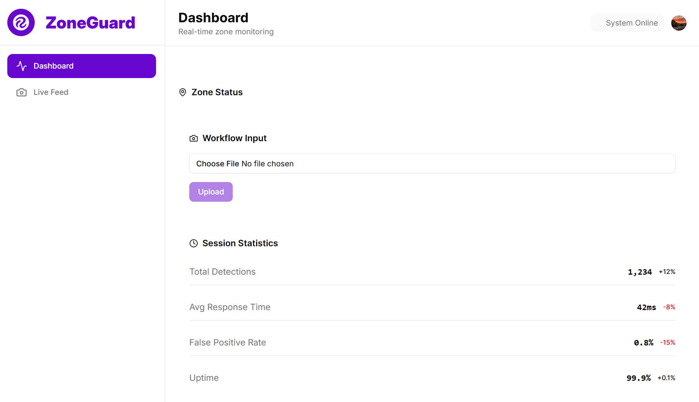

# ZoneGuard
This project is a real-time, zone-based, safety analytics platform, integrating the Roboflow Python SDK and the Supervision API.


### What It Does
1. User uploads video footage of a traffic cam or a car's dashcam
2. Platform's backend calls Roboflow inference and supervision APIs to segment video frames and detect objects using bounding boxes
3. Algorithm detects overlap between people and roadways for warnings, and people and cars for alerts


## Tech Stack
- React Router
- Tailwind CSS
- Shadcn UI
- Clerk
- Roboflow Inference
- Roboflow Supervision
- Python
- Flask
- OpenCV

[](https://stackblitz.com/github/remix-run/react-router-templates/tree/main/default)

### Installation & Development

Install the frontend dependencies:

```bash
npm install
```

Start the development server with HMR:

```bash
npm run dev
```

Install the backend dependencies:

```bash
cd api
```

```bash
pip install -r requirements.txt
```

Start the backend server:

```bash
flask --app main:app run
```

Your React app will be available at `http://localhost:5173`.
Your Flask API will be available at `http://localhost:8000`.

## Building for Production

Create a production build:

```bash
npm run build
```

## Deployment

### Docker Deployment

To build and run using Docker:

```bash
docker build -t my-app .

# Run the container
docker run -p 3000:3000 my-app
```

The containerized application can be deployed to any platform that supports Docker, including:

- AWS ECS
- Google Cloud Run
- Azure Container Apps
- Digital Ocean App Platform
- Fly.io
- Railway

### DIY Deployment

If you're familiar with deploying Node applications, the built-in app server is production-ready.

Make sure to deploy the output of `npm run build`

```
├── package.json
├── package-lock.json (or pnpm-lock.yaml, or bun.lockb)
├── build/
│   ├── client/    # Static assets
│   └── server/    # Server-side code
```

## Styling

This template comes with [Tailwind CSS](https://tailwindcss.com/) already configured for a simple default starting experience. You can use whatever CSS framework you prefer.

---

Built with ❤️ using React Router.
